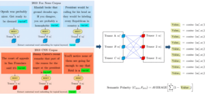

## CROSS: Counter Response Online Suggestion System (CROSS): Leveraging Linguistic Artificial Intelligence to Help Users Counter Gray Areas of Online Toxicity

{: .align-left}

With the growing volume of online discourse, users routinely encounter a wide spectrum of online aggression. Some choose to respond directly in order to intervene, refute, or solicit further discussion from the offender, engaging in what is known as counter-speech or counter-responses. However, directly countering online aggression can be time-consuming, emotionally, and mentally burdensome, and risky as the aggressor may retaliate. How can recent advancements in language technologies help mitigate such challenges faced by users in the context of engaging in online counter-responses? In this project, we focus specifically on online racial microaggressions or online posts that contain implicit aggressions that are racially motivated.  Strategies and linguistic styles that underly effective counter responses may vary depending on the various contexts, topics, and levels of racially motivated implicit aggression. Yet, there is no systematic research granularly examining how counter responses vary across such typology of online racial microaggressions nor what makes online counter responses effective. This project addresses such gap by (1) systematically examining the linguistic characteristics of effective online counter responses across a broad array of online racial microaggressions at-scale and (2) developing computational approaches based on language generation techniques to help reduce the burden of responding to online racial aggression by assisting users in crafting effective online counter responses through an interactive visual user interface system.

## Same Work, Different Meanings: Semantic Polarization in Broadcast Media Language

{: .align-left}

NLP researchers studying diachronic shifts have been leveraging word embeddings from language models to understand how a meaning of a given word changes over time. In this project, we adapt methodological intuitions from such prior work to develop a new technique to quantify how semantic polarization – the semantic distance between how two entities contextually use an identical word – evolves over time. Using 10 years’ worth of closed caption data from 24-hr news programs broadcasted by CNN and Fox News from 2010 – 2020, we examine how semantic polarization in broadcast media language has evolved between America’s two largest television broadcast networks over the last ten years. We use contextual representations from large language models to capture the semantic polarity around how politically charged words (e.g., “racism”, “Black Lives Matter”, “police”, “immigration”, “climate change”, and “health care”) have been used by CNN and Fox News, as well as model interpretation techniques to understand what words contribute most to the polarity spikes across time. Furthermore, to under the impact of legacy media on online democratic discourse, we use granger causality to test whether trends in linguistic polarization in broadcast media language forecast similar trends on social media.

## Using Interpretable NLP and Experimental Participant Studies to Understand the Role of Officer Speech in Escalated Traffic Stops of Black Drivers

{: .align-left}

In this project, we examine whether traffic stops where the driver is eventually searched, handcuffed, or arrested –what we call “escalated” interactions—are distinguished in the earliest moments of the encounter. In other words, do escalated stops begin with a different tone or in a tenser manner than stops that do not involve a search, handcuff, or arrest? How do these stops differ, both in what is said, and in how they are experienced by the public? We address these questions using thin slices of officer speech (initial words spoken by the officer to the driver) captured from thousands of police body-worn cameras. In this work, we use NLP and interpretation techniques in deep learning to identify patterns of officer speech that are associated with escalated vs. non-escalated outcomes. To compare our model results with human perspectives, we leverage participant studies to compare Black men’s perceptions of the officer’s demeanor, their imagined concerns in the interaction, and their predictions about what might occur during escalated vs. non-escalated stops.

*\*Considering the racial disparities in who is searched and handcuffed by police, divergent experiences at the hands of law enforcement, and the cultural significance of police stops we focus on stops of Black drivers in this work. This project is funded by the MacArthur Foundation and a collaboration with Stanford University’s department of Computer Science and SPARQ.*

## Investigating Intergroup Biases Across Gists in Health Mandate Resistance

{: .align-left}

In this project, we investigate the language surrounding extreme resistance towards government-mandated health practices through the lens of fuzzy-trace theory and its central concept of gist to better understand risk perceptions and communicative patterns contributing to people’s attitude and decisions around health mandates (HMs). This project synthesizes deep learning techniques in natural language processing with theoretical perspectives from social psychology to advance the knowledge of human behavior in the context of resisting public health mandates. Our proposed methods allow efficient scaling of predicting risk perceptions and communicative patterns with technical granularity, thereby increasing the analytical depth and scope of insights associated with the anti-HM discourse across the public